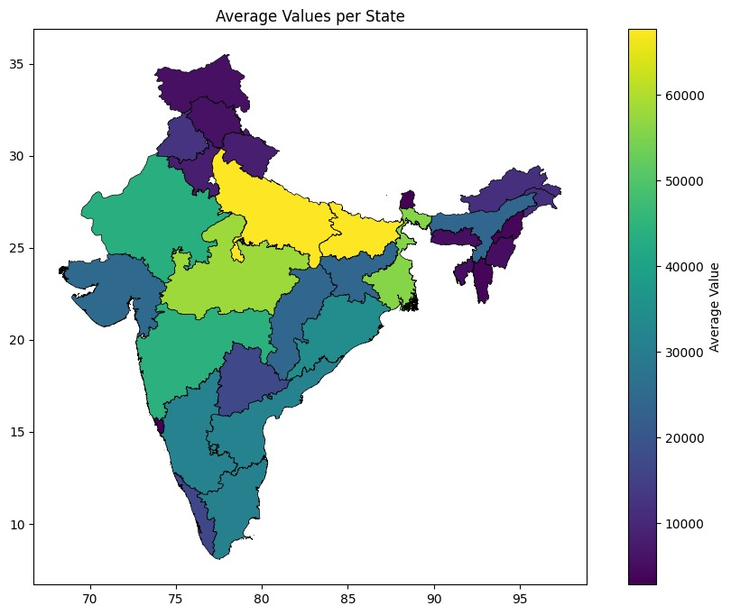

# HackOFest

# Project Name: SocioEconomic Analysis of States of India

## Tagline:
Unveiling India's fiscal health! Dive into 5 yrs of state tax data via dynamic map. See high & low revenue areas to understand regional economies. Viewed with a gradient map!

## Description:
This project offers a comprehensive socio-economic analysis of Indian states through dynamic map visualizations. By integrating geospatial data and tax revenue information, it provides insights into regional economies, highlighting high and low revenue areas. The color-coded maps facilitate easy identification of spatial patterns, aiding policymakers, analysts, researchers, and communities in decision-making, strategic planning, engagement, evaluation, and research.

## Problems Solved:

- **Geospatial Data Integration:** Seamlessly combines GeoJSON files containing geographical boundaries and average values.
- **Color-Coded Visualization:** Uses color gradients to represent different average values, making spatial patterns easily recognizable.
- **Adjustable Brightness:** Includes a scale factor to fine-tune brightness for optimal visualization.

## Existing Tasks Made Easier:

- **Policy Decision Support:** Clearly highlights how policymakers can use the visualizations to allocate resources and prioritize policies based on regional needs.
- **Strategic Planning:** Emphasizes how analysts can leverage these maps to identify trends and develop targeted strategies for socioeconomic development.
- **Community Engagement:** Underscores the value of maps for fostering communication and raising awareness within communities.
- **Evaluation and Monitoring:** Provides a concrete approach for organizations to track progress and assess the effectiveness of interventions using these visualizations.
- **Research and Analysis:** Demonstrates the code's utility for researchers to conduct spatial analyses and explore socio-economic dynamics.

## Challenges Faced:

- **Geospatial Data Integration:** Combining GeoJSON files containing state boundaries with average values posed a challenge due to differences in data formats and structures. Ensuring seamless integration required careful data preprocessing and handling to align the geographical boundaries with the corresponding average values accurately.
- **Visualization Complexity:** Visualizing average values across Indian states in a clear and informative manner required overcoming the complexity of geospatial data representation. Selecting appropriate color gradients, legend scales, and visualization techniques was essential to ensure that the resulting maps effectively communicated the variations in socioeconomic indicators without overwhelming the viewer.
- **Scale Adjustment:** Adjusting the brightness scale to optimize the visualization for different datasets and analysis purposes presented a challenge. Determining the appropriate scale factor to enhance contrast and highlight relevant patterns while avoiding visual distortion required iterative testing and experimentation to achieve optimal results.

## Image from the project

### Website landing page

### Processed

### Output Image (Poverty Map of INDIA statewise)

## Video Demo

## Contribution

Contributions to this project, whether through feedback, suggestions, or code contributions, are highly appreciated. Together, we can harness the potential of nighttime satellite imagery to address socio-economic challenges in cities.

## License

This project is licensed under the [GNU General Public License version 3.0 (GPL-3.0)](LICENSE).

---
This README.md file provides an overview of the project, its functionalities, and the challenges encountered during development. For further details, refer to the respective sections.
